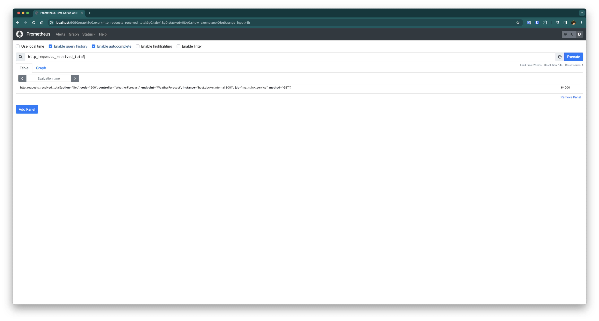

# Monitoring App 

This project is developed to visualize the operational metrics of a .NET Core web API application. Prometheus, Grafana, and Sonarqube are utilized for displaying the application metrics. 




You can follow the Docker Compose installation commands below to run the application with a single command:

## Navigate to the directory where the Docker Compose file is located
```bash
cd Docker\ Compose/
```

## Run the monitoring.yml file with the docker-compose command
```bash
docker-compose -f monitoring.yml up -d
```
